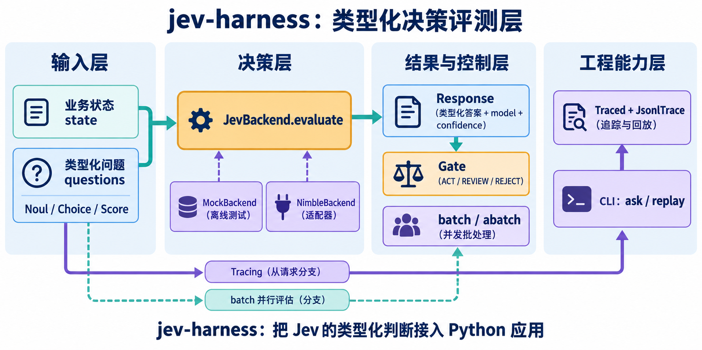

# jev-harness（中文说明）

用 Python 调用 [TypeSafe Jev](https://typesafe.ai) 决策模型的类型化工具包。

Jev 不是 LLM。你发给它一个 `state` 和一组类型化问题，它返回带校准概率的类型化答案，不生成文本、不需要解析。`jev-harness` 在这个契约上提供：

- **类型化问答**：`Noul`（是/否概率）、`Choice`（最多 255 个选项选一）、`Score`（2–10 个有序等级），发送前本地校验。
- **可插拔后端**：`JevBackend`（HTTP，429/529 指数退避重试）、`MockBackend`（离线、可脚本化，用于测试）、`NimbleBackend`（对接开源 [Bespoke Nimble](https://github.com/bespokelabsai/nimble) 打分器）。
- **置信度门控**：`Gate` 把任意答案转成 `ACT / REVIEW / REJECT`，支持按问题覆盖阈值。
- **审计追踪**：`Traced(backend, JsonlTrace(path))` 记录每次调用、失败以及真正作答的模型版本。
- **批处理**：`batch()` / `abatch()` 并发地对多个 state 问同一组问题。
- **命令行**：`jev-harness ask` 与 `jev-harness replay`。

## 功能结构图



> 社区项目，与 TypeSafe AI 无关联，不包含任何模型权重。

## 安装

```bash
pip install -e .
export TYPESAFE_API_KEY=...   # 在 https://console.typesafe.ai 申请
```

Python ≥ 3.10，唯一运行时依赖 `httpx`。

## 一分钟示例

```python
from jev_harness import JevBackend, Noul, Choice, Score, Gate

backend = JevBackend()  # 读取 TYPESAFE_API_KEY

resp = backend.evaluate(
    state={
        "ticket": "I was charged twice for order A-104. Please refund the duplicate.",
        "policy": "Duplicate charges are eligible for a refund.",
    },
    questions={
        "refund_requested": Noul("Does `ticket` request a refund?"),
        "policy_allows": Noul("Does `policy` support the refund requested in `ticket`?"),
        "department": Choice(
            "Which team should handle `ticket`?",
            {"billing": "Payments, refunds", "technical": "Bugs, outages", "sales": "Pricing"},
        ),
        "urgency": Score("How urgent is `ticket`?", ["can wait", "this week", "today"]),
    },
)

print(resp.nouls["refund_requested"].noul)     # 0.97
print(resp.choices["department"].choice)       # billing
print(resp.scores["urgency"].score)            # 1.6
print(Gate(act_at=0.8).decide_all(resp))
```

同一请求里的所有问题并行、相互独立地评估，多问几个问题只多花对应 token。

## 后端

```python
JevBackend(model="jev-1.13.0", retry=RetryPolicy(max_attempts=5))
MockBackend().add_rule("refund_requested", NoulAnswer(0.95))
NimbleBackend(scorer)   # Choice→enum，Noul→boolean，Score 不支持
```

`JevBackend` 有一个粗略的本地体积守卫（默认 200 kB），它不是 tokenizer；API 真实限制是整请求 64k token、state + 最长单题 32k token。

## 门控

Choice/Score 用 API 返回的 `confidence`；Noul 没有 confidence，门控用 `|p − 0.5| × 2`（很确定的"否"和很确定的"是"同样可执行）。

## 测试

```bash
pip install -e ".[dev]"
pytest                                   # 离线
TYPESAFE_API_KEY=... pytest -m live -v   # 真实 API 冒烟
```

## 注意事项

- Jev 主要训练语言是英文，中文可用但准确率偏低，建议问题用英文、state 可以是中文，并在自己的数据上验证阈值。
- `jev-latest` 会随新版本移动，追踪记录里保存了真实 `model` 字段，调好阈值后建议固定版本号。
- 限流在发布期动态调整，可调 `RetryPolicy` 与 `batch(concurrency=...)`。
- Nimble 适配器只用假打分器做过单测，未在真实 Nimble 权重上验证。

MIT 许可。
